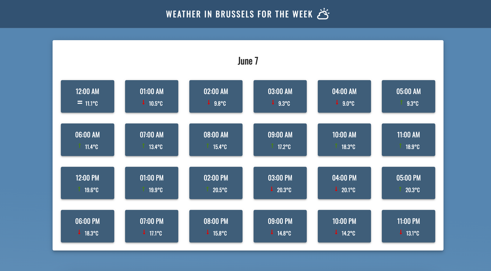

# Weather App

This is a Weather App that fetches weather data for Brussels and displays the forecast for one week. The app is built using React and Material UI components and is deployed on Netlify.

## Features

- Fetches and displays weather data for Brussels.
- Shows a 7-day weather forecast.
- Responsive design using Material UI.
- Deployed and accessible via Netlify.

## Demo

A live demo of the app [here](https://react-weather-api10.netlify.app/)

## Installation

### Clone the repository

    git clone https://github.com/yourusername/weather-app.git

### Navigate to the project directory

    cd weather-app

### Install the dependencies

    npm install

### Start the development server

    npm run dev

## Technologies Used

- **React**: JavaScript library for building user interfaces.
- **Material UI**: React components for faster and easier web development.
- **React Icons**: For icons used in the app.
- **Netlify**: For deployment.

## Screenshot

